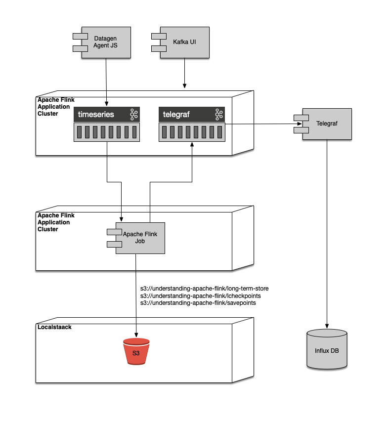

# Understanding Apache Flink

Repository used for my presentation on "Understanding Apache Flink" and demo source code.

## About the Author
Allow me to introduce myself. I am Marco A. Villalobos. My past roles have been software engineer and software architect.

I have been tasked with processing and moving "big" data throughout my career. An example of this was when
I had to process seven billion daily display advertising events on MySpace's ad-servers during its peak traffic days.
I used batch processing techniques back then that were quite effective, but did not horizontally scale.
This specific batch process ran every five minutes, but typically finished within two minutes. The business 
wanted to expand, and we wanted a better way of scaling the data processing. Apache Fink 
would have been the perfect solution, but it did not exist yet.

Over the next 10 years, I worked at several large companies that tasked my teams with processing "big" data.
They often tried to build their own "streaming-like" frameworks, and although the systems worked, they were by 
comparison to Apache Flink quite clumsy. They did not horizontally, were a challenge to restart, and lacked many of the 
features found in modern stream processing platforms.

Eventually, I landed a role as a hands-on software architect tasked with designing a real-time system that provided AI advice
to oil refinery engineers in a green-field project. It was my intent to provide a design that could horizontally scale
at every component within the system. Apache Flink was a natural choice for the stream processing aspects of this system
because it could support the real-time use case effectively. There were many hard-lessons I picked up as the lead
stream processing engineer at my former company. I loved it! And now I am here to teach what I learned.

### Open to Work

Additionally, as of January 15, 2024, I have been open-to-work. I am hoping this presentation helps me find a job
where I can continue my growth in stream programming with Apache Flink, data-architecture, and 
hands-on software architecture.

You can pick up my resume at https://mvillalobos.kineteque.com or at my 
[LinkedIn Profile](https://www.linkedin.com/in/marcovillalobosjr/).

If you know a job that fits, please refer me.

You can also contact me at mvillalobos@kineteque.com. Thank you!

## System Design



### Elements and Responsibilities

| Element                          | Responsibility                                                                                                                                                                                                                                        |
|----------------------------------|-------------------------------------------------------------------------------------------------------------------------------------------------------------------------------------------------------------------------------------------------------|
| Apache Flink Application Cluster | Apache Flink components that process Apache Flink stream jobs.                                                                                                                                                                                        |
| Apache Flink Job                 | Apache Flink code that represents a streaming job.                                                                                                                                                                                                    |
| Apache Kafka Cluster             | Apache Kafka components that serve Kafka topics.                                                                                                                                                                                                      |
| Datagen Agent JS                 | Open-source application component that publishes simulated time series data into the "timeseries" Apache Kafka topic.                                                                                                                                 |
| Influx DB                        | Open-source time series database that serves as the speed layer.                                                                                                                                                                                      |                                                                                               
| Kafka UI                         | Open-source application UI component that allows for viewing Apache Kafka messages.                                                                                                                                                                   |
| Localstack                       | Open-source application component that emulates Amazon Web Services. It hosts "understanding-apache-flink" s3 bucket.                                                                                                                                 |
| S3                               | Amazon S3 or Amazon Simple Storage Service is a service offered by Amazon Web Services that provides object storage through a web service interface.                                                                                                  |
| S3 Manager                       | Open-source application UI component that allows browsing s3 storage.                                                                                                                                                                                 |
| s3://understanding-apache-flink  | S3 bucket that contains three types of data: <ol><li>`/long-term-store` that contains the time series data in Parquet format.<li>`/checkpoints` that contains Apache Flink checkpoints.<li>`/savepoints` that contains Apache Flink save points.</ol> |
| Telegraf                         | Open-source agent that collects time series data for Influx DB.                                                                                                                                                                                       |
| telegraf Apache Kafka topic      | Apache Kafka topic that contains Influx DB line-format messages.                                                                                                                                                                                      |
| timeseries Apache Kafka topic    | Apache Kafka topic that contains time series messages in CSV format.                                                                                                                                                                                  |

## The Presentation

This presentation is the first part of a series of three Apache Flink presentations that I am writing.

1. Understanding Apache Flink.
2. Apache Flink Patterns.
3. Understanding Apache Flink Stateful Functions.

This first presentation introduces Apache Flink and its core concepts. The target audience is software engineers that 
need an introduction to Apache Flink.

Additionally, this presentation offers an opportunity to learn and integrate many different technologies. It offers
the following:
* A complete Apache Flink job that uses the Data-Stream API and SQL API that writes all incoming data into s3 in Parquet 
format and writes aggregate time-series data into Influx DB.
* A data generator deployed into a Kubernetes cluster.
* An Apache Kafka Cluster deployed into a Kubernetes cluster with the Strimzi Kafka Operator.
* An Apache Flink job deployed into a Kubernetes cluster with the Apache Flink Kubernetes Operator.
* Localstack deployed into a Kubernetes cluster that simulates the S3 Amazon Web Services.
* InfluxDB time-series database and Telegraf ingestion component deployed into a Kubernetes cluster.
* Kafka UI deployed into a Kubernetes cluster.
* Containerized system components built with Minikube.
* A fully containerized distributed application deployed locally into Kubernetes cluster with Minikube.
* A real-world example of how to build a containerized Apache Flink job with Gradle. 

[](https://www.youtube.com/embed/jl9uu0Zy_fI "Understanding Apache Flink")

## Build

I implemented this project on macOS Sonoma. I installed the following tools.

1. Docker Desktop (I needed it to use Hyperkit)
2. Macports
3. Minikube 1.32.0 via Macports.
4. Helm 3.14.2 via Macports.
5. sdkman
6. Azul OpenJDK 11 via sdkman.
7. Gradle 7.6.3 via Sdkman.

## Demo

1. If it is not already started, start minikube and open its dashboard. 
```shell
minikube start --memory=12888 --cpus=6
minikube dashboard
```
2. Build the required images.
```shell
git clone https://github.com/minmay/data-gen-agent-js.git build/data-gen-agent-js
minikube image build -t minmay/data-gen-agent-js:1.0.0 build/data-gen-agent-js
minikube image build -t minmay/understanding-apache-flink:latest .
minikube image build -t minmay/flink:1.18.1-scala_2.12-hadoop-3.3.6-java11 ./conf/flink
```
3. Deploy to Kubernetes local cluster with minikube and helm.
```shell
kubectl create namespace understanding-apache-flink
kubectl create -f https://github.com/jetstack/cert-manager/releases/download/v1.8.2/cert-manager.yaml     
helm repo add flink-operator-repo https://downloads.apache.org/flink/flink-kubernetes-operator-1.8.0/ -n understanding-apache-flink
helm install --set webhook.create=false flink-kubernetes-operator flink-operator-repo/flink-kubernetes-operator -n understanding-apache-flink
kubectl create -f 'https://strimzi.io/install/latest?namespace=understanding-apache-flink' -n understanding-apache-flink
kubectl apply -f conf/deployment-understanding-apache-flink.yaml -n understanding-apache-flink
kubectl apply -f conf/services-understanding-apache-flink.yaml -n understanding-apache-flink
kubectl apply -f conf/flink-operator-understanding-apache-flink.yaml -n understanding-apache-flink
```
4. Open a minikube tunnel.
```shell
minikube tunnel
```
5. Port forward the Apache Flink dashboard.
```shell
kubectl port-forward svc/understanding-apache-flink-deployment-rest 8081 -n understanding-apache-flink
```
6. Port forward the Influx DB dashboard
```shell
kubectl port-forward svc/influxdb-service 8086 -n understanding-apache-flink
```
7. Port forward the Kafka UI
```shell
kubectl port-forward svc/kafka-ui-service 58080:8080 -n understanding-apache-flink  
```
7. Port forward the s3 Manager UI
```shell
kubectl port-forward svc/s3manager-service 32280:8080 -n understanding-apache-flink
```
8. Open dashboards
```shell
open http://localhost:8081
open http://localhost:8086
open http://localhost:58080
open http://localhost:32280
```
9. teardown the deployment
```shell
kubectl delete -f conf/flink-operator-understanding-apache-flink.yaml -n understanding-apache-flink
kubectl delete -f conf/services-understanding-apache-flink.yaml -n understanding-apache-flink
kubectl delete -f conf/deployment-understanding-apache-flink.yaml -n understanding-apache-flink
helm uninstall flink-kubernetes-operator -n understanding-apache-flink
helm repo remove flink-operator-repo -n understanding-apache-flink
kubectl delete -f 'https://strimzi.io/install/latest?understanding-apache-flink' -n understanding-apache-flink
kubectl delete -f https://github.com/jetstack/cert-manager/releases/download/v1.8.2/cert-manager.yaml
kubectl delete namespace understanding-apache-flink
```
## Application Development Playbooks
### Access the Kafka Broker
Kafka clients external to the Kubernetes cluster, such as an IDE, should use load-balancer ip address of 
`data-gen-agent-kafka-extlb-bootstrap` which can be viewed with the following command.
```shell
kubectl get services -n understanding-apache-flink | awk '{if (match($1, /^understanding\-apache\-flink\-kafka\-extlb\-bootstrap/) > 0){print $4.":9094"}}'  
```
### Access to S3 buckets via AWS CLI
1. First port forward Localstack
```shell
kubectl port-forward svc/localstack-service 32280:4566 -n understanding-apache-flink  
```
2. Issue AWS CLI s3 command with `endpoint-url` parameter. 
```shell
aws --endpoint-url http://localhost:32280 s3 ls    
```
